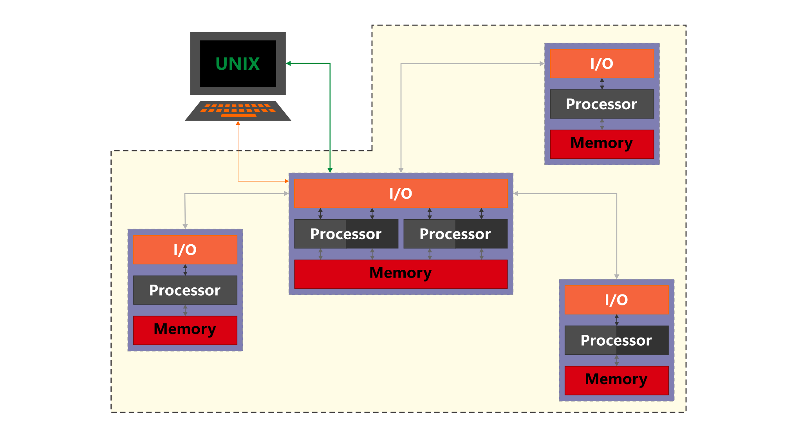
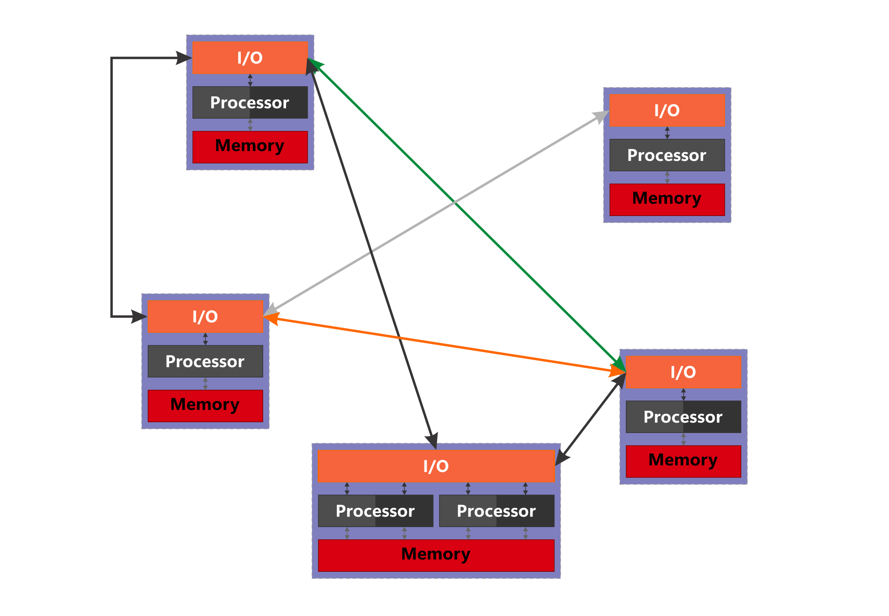

# Sistemas Descentralizados

<code>Fundamentos de sistemas Distribuidos</code>

Creado por <code>GncDev</code> para explicar los fundamentos de los <code>Sistemas distribuidos</code>.

## Fundamentos
La administración y los servicios que ofrece un sistema de procesamiento digital, pueden estar distribuidos en diferentes componentes de hardware y con diferentes niveles de acoplamiento entre ellos.

## Agenda
1. [Sistemas mainframe](#1-sistemas-mainframes).
1. [Sistemas centralizados](#2-sistemas-centralizados).
1. [Sistemas distribuidos](#3-sistemas-distribuidos).
1. [Sistemas descentralizados](#4-sistemas-descentralizados).

 

---
# 1. [Sistemas Mainframes](#agenda)
Un sistema [mainframe][1] es una entidad que permite el procesamiento de información y soporta multiples usuarios en multiples terminales falsas, que no tienen capacidad de procesamiento.

* ><i>"La ciencia es una ecuación diferencial; 
la religión es una condición de frontera."</i> 
<cite style="display:block; text-align: right">[Alan Turing](https://es.wikipedia.org/wiki/Alan_Turing)</cite>

[1]:https://es.wikipedia.org/wiki/Unidad_central

## 1.1. Multiples terminales ✔

## 1.2. Justificación ✔
Con la necesidad de procesar multiples y diversas tareas en tiempo real se desarrolla los sistemas operativos mainframe para las grandes unidades de procesamiento.

## 1.3. Características ✔
* Las terminales locales no realizan procesos.
* Todos los procesos se ejecutan en el mainframe y comparten memoria.
* Los procesos pueden ejecutarse paralelos o en concurrencia.
* Existe un reloj común y global entre las terminales y usuarios.
* Capacidad de escalar unicamente verticalmente.
* Terminales fuertemente acoplados al mainframe, si falla falla el sistema.

## 1.3.1. Ventajas.
* Alta velocidad procesamiento.
* Entrada/Salida única.
* No es necesaria la sincronización.

## 1.3.2. Desventajas.
* Computador central de gran tamaño y muy costoso.
* Las terminales carecen de funcionalidad por si mismas.
* Un único punto de fallo.

## 1.4. Ejemplos y aplicaciones ✔
* __Software:__ [Z/OS][14_1] y [Z/VM][14_2] de IBM.
* __Hardware:__ serie [Z][14_3] de IBM.
* __Aplicaciones:__ [Redes neuronales][14_4] para [IA][14_5].

[14_1]:https://es.wikipedia.org/wiki/Z/OS
[14_2]:https://en.wikipedia.org/wiki/Z/VM
[14_3]:https://en.wikipedia.org/wiki/IBM_Z
[14_4]:https://es.wikipedia.org/wiki/Red_neuronal_artificial
[14_5]:https://es.wikipedia.org/wiki/Inteligencia_artificial

 

# 2. [Sistemas Centralizados](#agenda)
Un sistema [centralizado][2] es una entidad que permite el procesamiento de información y soporta multiples usuarios en multiples terminales inteligentes, que intercambian información de cliente a servidor.

* ><i>"Es indigno que hombres notables pierdan su tiempo como esclavos del cálculo cuando podrían dejar ese trabajo en manos de cualquiera si se usaran las máquinas."</i> <cite style="display:block; text-align: right">[Gottfried Leibniz](https://es.wikipedia.org/wiki/Gottfried_Leibniz)</cite>

[2]:https://es.wikipedia.org/wiki/Computaci%C3%B3n_centralizada

## 2.1. Multiples clientes ✔

## 2.2. Justificación ✔
Con el rápido crecimiento de las redes y la necesidad de disminuir costos de las unidades centrales aparecen los micro-computadoras con capacidad de procesar multiples tareas en tiempo real y conectarse entre si para compartir recursos.

## 2.3. Características ✔
* Los terminales locales realizan procesos propios.
* Los procesos locales y remotos no comparten memoria.
* Los terminales locales y remotos comparten recursos en una red.
* Los procesos remotos pueden ejecutarse sincronizados o pueden ser asíncronos.
* Capacidad de escalar verticalmente y horizontalmente.
* Clientes débilmente acoplados al servidor, si alguna capa falla puede fallar la aplicación.

## 2.3.1. Ventajas.
* Diseños basados en micro-computadoras son mas pequeños y baratos que mainframe.
* Posibilita la distribución de una aplicación por capas.
* Posibilidad de distintos tipos de clientes ([Liviano][231_1] - [Pesado][231_2] - [Híbrido][231_3])

[231_1]:https://es.wikipedia.org/wiki/Cliente_liviano
[231_2]:https://es.wikipedia.org/wiki/Cliente_pesado
[231_3]:https://es.wikipedia.org/wiki/Cliente_h%C3%ADbrido

## 2.3.2. Desventajas.
* Las terminales tienen funcionalidad limitada por el sistema.
* Un punto de fallo critico es el nodo principal ([Servidor][232_1]).
* Baja o nula privacidad; el Servidor tiene acceso a toda la información de los clientes.

[232_1]:https://es.wikipedia.org/wiki/Servidor

## 2.4. Ejemplos y aplicaciones ✔
* __Software:__ el software libre [GNU/Linux][24_1] y [Windows][24_2] de Microsoft.
* __Servidores:__ serie [PowerEdge][24_3] de DELL y la serie [ProLiant][24_4] de HP.
* __Clientes:__ serie [Legion][24_5] de Lenovo.
* __Aplicaciones:__ [Spotify][24_6] para distribución de música.

[24_1]:https://es.wikipedia.org/wiki/GNU/Linux
[24_2]:https://es.wikipedia.org/wiki/Microsoft_Windows
[24_3]:https://en.wikipedia.org/wiki/List_of_PowerEdge_servers
[24_4]:https://en.wikipedia.org/wiki/ProLiant
[24_5]:https://en.wikipedia.org/wiki/Lenovo_Legion
[24_6]:https://open.spotify.com/

 

# 3. [Sistemas distribuidos](#agenda)
Un sistema [distribuido][3] es un grupo de entidades conectadas en red que se comportan como una y permiten el procesamiento de información de multiples usuarios en multiples terminales inteligentes.

* ><i>"La gente con conocimientos técnicos está dispuesta a perdonar a un ordenador que se cuelga un par de veces al año, pero los usuarios normales no."</i> <cite style="display:block; text-align: right"> [Andrew S. Tanenbaum](https://es.wikipedia.org/wiki/Andrew_S._Tanenbaum)</cite>

[3]:https://es.wikipedia.org/wiki/Computaci%C3%B3n_distribuida

## 3.1. Multiples servidores ✔

## 3.2. Justificación ✔
Con el crecimiento de la [capacidad][32_1] de los canales en las redes y buscando una mayor eficiencia de procesamiento aparecen la [programación distribuidos][32_2] y los [sistemas operativos distribuidos][32_3] con capacidad de ejecutar procesos remotos de forma protegida y ordenada.

[32_1]:https://es.wikipedia.org/wiki/Capacidad_de_canal
[32_2]:https://es.wikipedia.org/wiki/Programaci%C3%B3n_distribuida
[32_3]:https://en.wikipedia.org/wiki/Distributed_operating_system

## 3.3. Características ✔
* Procesamiento Cooperativo.
* Los procesos locales y remotos no comparten memoria.
* Los procesos remotos son asíncronos.
* Operaciones similares o idénticas para acceder a objetos locales o remotos.
* Capacidad de escalar verticalmente y horizontalmente.
* Clientes desacoplados a un servidor, la falla de un terminal no afecta al sistema.

## 3.3.1. Ventajas.
* Tolerancia de fallos parciales.
* Mas económico de escalar.
* Mayor flexibilidad.

## 3.3.2. Desventajas.
* Comunicación mas costosa y compleja que [IPC][232_1].
* Comunicación menos segura que [IPC][232_1].
* Posibles inconsistencias.

[232_1]:https://es.wikipedia.org/wiki/Comunicaci%C3%B3n_entre_procesos

## 3.4. Ejemplos y aplicaciones ✔
* __Software:__ [Solaris][34_1] de Oracle y el software libre [Proxmox][34_2] .
* __Hardware:__ [Clúster][34_3] de computadoras y computación en [Malla][34_4] computing.
* __Aplicaciones:__ Servicio [DNS][34_5].

[34_1]:https://es.wikipedia.org/wiki/Solaris_(sistema_operativo)/
[34_2]:https://es.wikipedia.org/wiki/Proxmox_Virtual_Environment
[34_3]:https://es.wikipedia.org/wiki/Cl%C3%BAster_de_computadoras
[34_4]:https://es.wikipedia.org/wiki/Sistema_de_nombres_de_dominio
[34_5]:https://es.wikipedia.org/wiki/Computaci%C3%B3n_en_malla

 

# 4. [Sistemas descentralizados](#agenda)
Un sistema [descentralizado][4] es un grupo de entidades que permiten el procesamiento de información intercambiando información entre pares, sin que exista un nodo único que toma las decisiones.  

* ><i>"Si nadie se ríe de alguna de tus ideas, entonces significa que no estás siendo demasiado creativo."</i> <cite style="display:block; text-align: right"> [Bill Gates](https://es.wikipedia.org/wiki/Bill_Gates)</cite>

[4]:https://es.wikipedia.org/wiki/Aplicaci%C3%B3n_descentralizada

## 4.1. Multiples servidores ✔

## 4.2. Justificación ✔
Contando con la ubicuidad de internet se posibilita buscar democratizar los recursos de internet y aumentar la eficiencia del procesamiento de datos con sistemas descentralizados con capacidad de procesar y almacenar con transparencia información en multiples nodos simultáneamente.

## 4.3. Características ✔
* Un solo nodo no conoce el estado de todo el sistema.
* Cada nodo toma la decision mas conveniente.
* La respuesta colectiva se logra en función del consenso entre pares.
* Multiples controladores.
* Distribución de los costes (recursos) entre los usuarios.
* Capacidad de escalar horizontalmente con rapidez.
* Clientes desacoplados.

## 4.3.1. Ventajas.
* Colaborativo y descentralizado
* Tolerancia a fallos.
* Transparente y flexible.

## 4.3.2. Desventajas.
* Complejidad.
* Seguridad.
* Confiabilidad.

## 4.4. Ejemplos y aplicaciones ✔
* __Software:__ [Cadena de bloques][44_1].
* __Aplicaciones:__ [BitCoin][44_2].

[44_1]:https://es.wikipedia.org/wiki/Cadena_de_bloques
[44_2]:https://es.wikipedia.org/wiki/Bitcoin

 

---
## Mas Recursos
- [Computación distribuida](https://es.wikipedia.org/wiki/Computaci%C3%B3n_distribuida) (Wikipedia)
- [Problema de la programación distribuida](https://www.youtube.com/watch?v=ADp7_3ygB2M) (YuTube)
- [Problema de los dos generales](https://es.wikipedia.org/wiki/Problema_de_los_dos_generales) (Wikipedia)