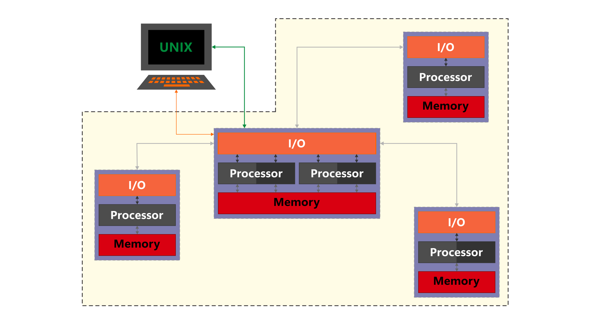

# Sistemas Descentralizados

<code>Fundamentos de sistemas Distribuidos</code>

Creado por <code>Giancarlo Ortiz</code> y <code>Diego Villareal</code> para explicar los fundamentos de los <code>Sistemas distribuidos</code>

## Fundamentos
La administración y los servicios que ofrece un sistema de procesamiento digital, pueden estar distribuidos en diferentes componentes de hardware y según como organicen pueden ser clasificados.

## Agenda

1. [Sistemas mainframe](#1-sistemas-mainframes).
1. [Sistemas centralizados](#2-sistemas-centralizados).
1. [Sistemas distribuidos](#3-sistemas-distribuidos).
1. [Sistemas descentralizados](#4-sistemas-descentralizados).

 

---
# 1. Sistemas Mainframes
Un sistemas [mainframe][1] es una entidad que permite el procesamiento de información y soporta multiples usuarios en multiples terminales falsas, que no tienen capacidad de procesamiento.

* ><i>"La ciencia es una ecuación diferencial; 
la religión es una condición de frontera."</i> 
<cite style="display:block; text-align: right">[Alan Turing](https://es.wikipedia.org/wiki/Alan_Turing)</cite>

[1]:https://es.wikipedia.org/wiki/Unidad_central

## 1.1. Multiples terminales ✔

## 1.2. Justificación ✔
Con la necesidad de procesar multiples y diversas tareas en tiempo real se desarrolla los sistemas operativos mainframe para las grandes unidades de procesamiento.

## 1.3. Características ✔
* Las terminales locales no realizan procesos.
* Todos los procesos se ejecutan en el mainframe y comparten memoria.
* Los procesos pueden ejecutarse paralelos o en concurrencia.
* Existe un reloj común y global entre las terminales y usuarios.
* Capacidad de escalar unicamente verticalmente.
* Terminales fuertemente acoplados al mainframe, si falla falla el sistema.

## 1.3.1. Ventajas
* Alta velocidad procesamiento.
* Entrada/Salida única.
* No es necesaria la sincronización.

## 1.3.2. Desventajas
* Computador central de gran tamaño y muy costoso.
* Las terminales carecen de funcionalidad por si mismas.
* Un único punto de fallo.

## 1.4. Ejemplos y aplicaciones ✔
* __Software:__ [Z/OS][14_1] y [Z/VM][14_2] de IBM.
* __Hardware:__ Serie [Z][14_3] de IBM.
* __Aplicaciones:__ [Redes neuronales][14_4] para [IA][14_5].

[14_1]:https://es.wikipedia.org/wiki/Z/OS
[14_2]:https://en.wikipedia.org/wiki/Z/VM
[14_3]:https://en.wikipedia.org/wiki/IBM_Z
[14_4]:https://es.wikipedia.org/wiki/Red_neuronal_artificial
[14_5]:https://es.wikipedia.org/wiki/Inteligencia_artificial

 

# 2. Sistemas Centralizados
Un sistemas [centralizado][2] es una entidad que permite el procesamiento de información y soporta multiples usuarios en multiples terminales inteligentes, que intercambian información de cliente a servidor.

* ><i>"Es indigno que hombres notables pierdan su tiempo como esclavos del cálculo cuando podrían dejar ese trabajo en manos de cualquiera si se usaran las máquinas."</i> 
<cite style="display:block; text-align: right">[Gottfried Leibniz](https://es.wikipedia.org/wiki/Gottfried_Leibniz)</cite>

[2]:https://es.wikipedia.org/wiki/Computaci%C3%B3n_centralizada

## 2.1. Multiples clientes ✔

## 2.2. Justificación ✔
Con el rápido crecimiento de las redes y la necesidad de disminuir costos de las unidades centrales aparecen los micro-computadoras con capacidad de procesar multiples tareas en tiempo real y conectarse entre si para compartir recursos.

## 2.3. Características ✔
* Los terminales locales realizan procesos propios.
* Los procesos locales y remotos no comparten memoria.
* Los terminales locales y remotos comparten recursos en una red.
* Los procesos remotos pueden ejecutarse sincronizados o pueden ser asíncronos.
* Capacidad de escalar verticalmente y horizontalmente.
* Clientes débilmente acoplados al servidor, si alguna capa falla puede fallar la aplicación.

## 2.3.1. Ventajas
* Diseños basados en micro-computadoras son mas pequeños y baratos que mainframe.
* Posibilita la distribución de una aplicación por capas.
* Posibilidad de distintos tipos de clientes ([Liviano][231_1] - [Pesado][231_2] - [Híbrido][231_3])

[231_1]:https://es.wikipedia.org/wiki/Cliente_liviano
[231_2]:https://es.wikipedia.org/wiki/Cliente_pesado
[231_3]:https://es.wikipedia.org/wiki/Cliente_h%C3%ADbrido

## 2.3.2. Desventajas
* Las terminales tienen funcionalidad limitada por el sistema.
* El punto de fallo es el nodo principal ([Servidor][232_1]).
* Baja o nula privacidad; el Servidor tiene acceso a toda la información de los clientes.

[232_1]:https://es.wikipedia.org/wiki/Servidor

## 2.4. Ejemplos y aplicaciones ✔
* __Software:__ [GNU/Linux][24_1] y [Windows][24_2] de Microsoft.
* __Servidores:__ Serie [PowerEdge][24_3] de DELL y la Serie [ProLiant][24_4] de HP.
* __Clientes:__ Serie [Legion][24_5] de Lenovo.
* __Aplicaciones:__ [Spotify][24_6] para distribución de música.

[24_1]:https://es.wikipedia.org/wiki/GNU/Linux
[24_2]:https://es.wikipedia.org/wiki/Microsoft_Windows
[24_3]:https://en.wikipedia.org/wiki/List_of_PowerEdge_servers
[24_4]:https://en.wikipedia.org/wiki/ProLiant
[24_5]:https://en.wikipedia.org/wiki/Lenovo_Legion
[24_6]:https://open.spotify.com/

 

# 3. Sistemas distribuidos
Un sistemas [distribuido][3] es un grupo de entidades conectadas en red que se comportan como una y permiten el procesamiento de información de multiples usuarios en multiples terminales inteligentes.

* ><i>"La gente con conocimientos técnicos está dispuesta a perdonar a un ordenador que se cuelga un par de veces al año, pero los usuarios normales no."</i> <cite style="display:block; text-align: right">
[Andrew S. Tanenbaum](https://es.wikipedia.org/wiki/Andrew_S._Tanenbaum)</cite>

[3]:https://en.wikipedia.org/wiki/Distributed_operating_system

## 3.1. Multiples servidores ✔

## 3.2. Justificación ✔
Con el crecimiento de la [capacidad][32_1] de los canales en las redes y buscando una mayor eficiencia de procesamiento aparecen los sistemas distribuidos con capacidad de ejecutar procesos remotos de forma protegida y ordenada.

[32_1]:https://es.wikipedia.org/wiki/Capacidad_de_canal

## 3.2. Características ✔
* Procesamiento Cooperativo.
* Los procesos locales y remotos no comparten memoria.
* Los procesos remotos son asíncronos.
* Capacidad de escalar verticalmente y horizontalmente.
* Clientes desacoplados a un servidor, la falla de un terminal no afecta al sistema.

## 2.3.1. Ventajas
* 

## 2.3.2. Desventajas
* Comunicación mas costosa que [IPC][232_1]
* Comunicación menos segura que [IPC][232_1]
* 

[232_1]:https://es.wikipedia.org/wiki/Comunicaci%C3%B3n_entre_procesos

* Diseños basados en micro-computadoras son mas pequeños y baratos que mainframe.
* Posibilita la distribución de una aplicación por capas.
* Posibilidad de distintos tipos de clientes ([Liviano][231_1] - [Pesado][231_2] - [Híbrido][231_3])

[231_1]:

* Las terminales tienen funcionalidad limitada por el sistema.
* El punto de fallo es el nodo principal ([Servidor][232_1]).
* Baja o nula privacidad; el Servidor tiene acceso a toda la información de los clientes.

## 3.3 Ventajas y desventajas ✔

| Ventajas | Desventajas |
|--|--|
| Mas barato escalar | Mas complejo escalar |
| Tolerancia a fallos | Confiabilidad |
| Mas flexible | Menos seguro |
| Colaborativo | Inconsistencias |
| Mas transparente | Análisis complejo  | 

 

# 4. Sistemas descentralizados
Un sistemas operativo [descentralizado][3] es una entidad que permite el procesamiento de información y soporta multiples usuarios en multiples terminales inteligentes, que intercambian información entre pares.

* ><i>"La gente con conocimientos técnicos está dispuesta a perdonar a un ordenador que se cuelga un par de veces al año, pero los usuarios normales no."</i> <cite style="display:block; text-align: right">
[Andrew S. Tanenbaum](https://es.wikipedia.org/wiki/Andrew_S._Tanenbaum)</cite>

[3]:https://en.wikipedia.org/wiki/Distributed_operating_system

## 4.1. Multiples servidores ✔

## 4.2. Características ✔
* Los procesos locales y remotos no comparten memoria.
* Los procesos remotos son asíncronos.
* Capacidad de escalar verticalmente y horizontalmente.
* Clientes desacoplados a un servidor, la falla de un terminal no afecta al sistema.

## 4.3 Ventajas y desventajas ✔

| Ventajas | Desventajas |
|--|--|
| Mas barato escalar | Mas complejo escalar |
| Tolerancia a fallos | Confiabilidad |
| Mas flexible | Menos seguro |
| Colaborativo | Inconsistencias |
| Mas transparente | Análisis complejo  | 

 

---
## Mas Recursos
- [Computación distribuida](https://es.wikipedia.org/wiki/Computaci%C3%B3n_distribuida) (Wikipedia)
- [Problema de los dos generales](https://es.wikipedia.org/wiki/Problema_de_los_dos_generales) (Wikipedia)

- [Cadena de bloques](https://es.wikipedia.org/wiki/Cadena_de_bloques) (Wikipedia)
- [Red entre iguales](https://es.wikipedia.org/wiki/Peer-to-peer) (Wikipedia)

- [Llamada a procedimiento remoto](https://es.wikipedia.org/wiki/Llamada_a_procedimiento_remotos) (Wikipedia)

- [Distributed Component Object Model](https://es.wikipedia.org/wiki/Modelo_de_Objetos_de_Componentes_Distribuidos) (Wikipedia)
- [Common Object Request Broker Architecture](https://es.wikipedia.org/wiki/CORBA) (Wikipedia)
- [Remote Method Invocation](https://es.wikipedia.org/wiki/Java_Remote_Method_Invocation) (Wikipedia)
- [Simple Object Access Protocol](https://es.wikipedia.org/wiki/Simple_Object_Access_Protocol) (Wikipedia)