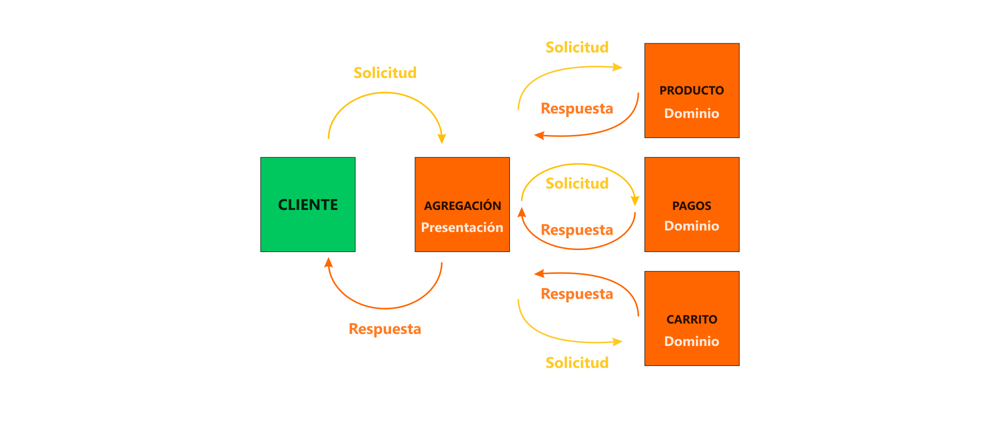

# Sistemas Descentralizados

<code>Fundamentos de sistemas Distribuidos</code>

Creado por <code>GncDev</code> para explicar los fundamentos de los <code>Sistemas distribuidos</code>.

## Arquitecturas de software
La arquitectura de software de un sistema es el conjunto de estructuras necesarias para dar sentido a un sistema, lo cual abarca los elementos del software, las relaciones entre ellos y las propiedades de ambos

## Agenda
1. [Monolíticas](#1-monolíticas).
1. [Distribuidas en capas](#2-distribuidas-en-capas).
1. [Distribuidas en dominios](#3-distribuidas-en-dominios).
1. [Descentralizadas](#4-descentralizadas).

 

---
# 1. [Monolíticas](#agenda)
Una arquitectura [monolítica][1] se refiere a una aplicación de software en la que la mayoría de las capas y dominios están fuertemente acopladas y combinadas en un mismo programa, en el mismo lugar y sobre una misma plataforma.

* ><i>"La ciencia es una ecuación diferencial; 
la religión es una condición de frontera."</i> 
<cite style="display:block; text-align: right">[Alan Turing](https://es.wikipedia.org/wiki/Alan_Turing)</cite>

[1]:https://es.wikipedia.org/wiki/Aplicaci%C3%B3n_monol%C3%ADtica

## 1.1. Servicios en internet ✔

## 1.2. Patrón Cliente-Servidor ✔
Una arquitectura [Client–server][1] se refiere a un sistema donde los clientes inteligentes se ponen en contacto con el servidor para hacer peticiones de datos, formatearlos y mostrarlos en una vista a los usuarios. Si los datos fueron modificados por el cliente se envían para persistir los datos en el servidor.

[1]:https://es.wikipedia.org/wiki/Cliente-servidor

### 1.2.1. Características.
* Los clientes hacen solicitudes de servicio.
* Los servidores dan respuesta a solicitudes de servicio.
* Los clientes inician la comunicación con el servidor.
* Los Los servidores proveen el servicio.

### 1.2.2. Multiples clientes.

## 1.3. Pila de tecnologías ✔
* [__ASP.Net__][13_2]: [IIS][13_1] - [SQLserver][13_3] - [C#][13_4]
* [__Laravel__][13_6]: [Apache][13_5] - [MySQL][13_7] - [PHP][13_8]
* [__Spring__][13_10]: [Tomcat][13_9] - [Oracle DB][13_11] - [Java][13_12]
* [__Django__][13_14]: [Nginx][13_13] - [PosgreSQL][13_15] - [Python][13_16]

[13_1]:https://es.wikipedia.org/wiki/Internet_Information_Services
[13_2]:https://es.wikipedia.org/wiki/ASP.NET_MVC_Framework
[13_3]:https://es.wikipedia.org/wiki/Microsoft_SQL_Server
[13_4]:https://es.wikipedia.org/wiki/C_Sharp

[13_5]:https://es.wikipedia.org/wiki/Servidor_HTTP_Apache
[13_6]:https://es.wikipedia.org/wiki/Laravel
[13_7]:https://es.wikipedia.org/wiki/MySQL
[13_8]:https://es.wikipedia.org/wiki/PHP

[13_9]:https://es.wikipedia.org/wiki/Tomcat
[13_10]:https://es.wikipedia.org/wiki/Spring_Framework
[13_11]:https://es.wikipedia.org/wiki/Oracle_Database
[13_12]:https://es.wikipedia.org/wiki/Java_(lenguaje_de_programaci%C3%B3n)#

[13_13]:https://es.wikipedia.org/wiki/Nginx
[13_14]:https://es.wikipedia.org/wiki/Django_(framework)#
[13_15]:https://es.wikipedia.org/wiki/PostgreSQL
[13_16]:https://es.wikipedia.org/wiki/Python

 

# 2. [Distribuidas en capas](#agenda)
Una arquitectura [n-Tier][2] o Multi-capas se refiere a sistemas donde un servidor reenvía peticiones del cliente a otros servicios conectados en cascada, estas horizontales son conocidas como capas y están débilmente acopladas entre si.

* ><i>"Es indigno que hombres notables pierdan su tiempo como esclavos del cálculo cuando podrían dejar ese trabajo en manos de cualquiera si se usaran las máquinas."</i> <cite style="display:block; text-align: right">[Gottfried Leibniz](https://es.wikipedia.org/wiki/Gottfried_Leibniz)</cite>

[2]:https://es.wikipedia.org/wiki/Programaci%C3%B3n_por_capas

## 2.1. Características ✔
* Los terminales locales realizan procesos propios.
* Los procesos locales y remotos no comparten memoria.
* Los terminales locales y remotos comparten recursos en una red.
* Los procesos remotos pueden ejecutarse sincronizados o pueden ser asíncronos.
* Capacidad de escalar verticalmente y horizontalmente.
* Clientes débilmente acoplados al servidor, si alguna capa falla puede fallar la aplicación.

## 2.2. Ejemplos arquitectura ✔
* [Frontend][22_1] - [Backend][22_2] : [2][22_3] capas.
* [Presentación][22_4] - [Lógica][22_5] - [Datos][22_7] : [3][22_8] capas.
* [Presentación][22_4] - [Aplicación][22_5] - [Dominio][22_6] - [Persistencia][22_7] : [4][22_9] capas.

[22_1]:https://es.wikipedia.org/wiki/Desarrollo_web_Front-end
[22_2]:https://es.wikipedia.org/wiki/Front_end_y_back_end
[22_3]:https://es.wikipedia.org/wiki/Front_end_y_back_end
[22_4]:https://es.wikipedia.org/wiki/Interfaz_de_usuario
[22_5]:https://en.wikipedia.org/wiki/Business_logic
[22_6]:https://en.wikipedia.org/wiki/Domain_(software_engineering)#
[22_7]:https://en.wikipedia.org/wiki/Data_access
[22_8]:https://en.wikipedia.org/wiki/Multitier_architecture#Three-tier_architecture
[22_9]:https://es.wikipedia.org/wiki/Arquitectura_multicapa

## 2.3. Pila de tecnologías ✔
* [Jinja ][23_1] - [template-engine][23_2] - Python (Plantillas)
* [Flask][23_3] - [micro-framework][23_4] - Python (RESTful APIs)
* [Gunicorn][23_5] - [interface-wsgi][23_6] - Python (Servidor HTTP)
* [SQLAlchemy][23_7] - [orm][23_8] - Python (Mapeo DB)
* [Swagger UI][23_9] -  interfaz Swagger (Documentación)

[23_1]:https://en.wikipedia.org/wiki/Jinja_(template_engine)#
[23_2]:https://en.wikipedia.org/wiki/Web_template_system
[23_3]:https://es.wikipedia.org/wiki/Flask
[23_4]:https://es.wikipedia.org/wiki/Microframework
[23_5]:https://en.wikipedia.org/wiki/Gunicorn
[23_6]:https://en.wikipedia.org/wiki/Web_Server_Gateway_Interface
[23_7]:https://en.wikipedia.org/wiki/SQLAlchemy
[23_8]:https://en.wikipedia.org/wiki/Object%E2%80%93relational_mapping
[23_9]:https://es.wikipedia.org/wiki/Swagger_(software)#

## 2.4. Multiples servidores en cascada ✔

 

# 3. [Distribuidas en dominios](#agenda)
Una arquitectura [distribuida verticalmente][3] se refiere  a sistemas donde un servidor reenvía peticiones del cliente a multiples servicios conectados en paralelo; estas verticales se conocen como dominios y están desacopladas entre si.

* ><i>"La gente con conocimientos técnicos está dispuesta a perdonar a un ordenador que se cuelga un par de veces al año, pero los usuarios normales no."</i> <cite style="display:block; text-align: right"> [Andrew S. Tanenbaum](https://es.wikipedia.org/wiki/Andrew_S._Tanenbaum)</cite>

[3]:https://es.wikipedia.org/wiki/Modelo_de_dominio

## 3.1. Patron proxy inverso ✔
Un [proxy inverso][31] es un tipo de servidor proxy que recupera recursos en nombre de un cliente externo, desde uno o más servidores internos.

[31]:https://es.wikipedia.org/wiki/Proxy_inverso

## 3.2. Ejemplos arquitectura ✔
* [Micro-servicios][32_1]
* [Sistemas Auto-contenidos][32_2]
* [Micro-frontend][32_3]

[32_1]:https://es.wikipedia.org/wiki/Arquitectura_de_microservicios
[32_2]:https://en.wikipedia.org/wiki/Self-contained_system_(software)#
[32_3]:https://es.wikipedia.org/wiki/Microfrontend

## 3.3. Pila de tecnologías ✔
* [GraphQL][23_1] - [lenguaje de consulta][23_2] (Agregación)
* [Asyncio][23_3] - [async/await-io][23_4] (Concurrencia)
* [FastAPI][23_5] - [asynchronous-framework][23_6] Python (RESTful APIs)
* [Pydantic][23_7] - [validation-library][23_8] Python (Validación)
* [Uvicorn][23_9] - [interface-asgi][23_10] - Python (Servidor HTTP)
* [OpenAPI][23_11] - [especificación API][23_12] (documentación)

[23_1]:https://graphql.org/learn/
[23_2]:https://es.wikipedia.org/wiki/GraphQL
[23_3]:https://docs.python.org/es/3/library/asyncio.html
[23_4]:https://en.wikipedia.org/wiki/Asynchronous_I/O
[23_5]:https://fastapi.tiangolo.com/es/
[23_6]:https://en.wikipedia.org/wiki/FastAPI
[23_7]:https://docs.pydantic.dev/latest/
[23_8]:https://es.wikipedia.org/wiki/Validaci%C3%B3n_de_datos
[23_9]:https://www.uvicorn.org/
[23_10]:https://en.wikipedia.org/wiki/Asynchronous_Server_Gateway_Interface
[23_11]:https://www.openapis.org/
[23_12]:https://es.wikipedia.org/wiki/Especificaci%C3%B3n_OpenAPI

## 3.4. Multiples servidores en paralelo ✔

 

# 4. [Descentralizadas](#agenda)
Una arquitectura [P2P][4] se refiere a sistemas donde no hay máquinas especiales que presten un servicio o gestionen los recursos de la red. En su lugar, todas las responsabilidades se reparten uniformemente entre todas las máquinas, conocidas como peers.

* ><i>"Si nadie se ríe de alguna de tus ideas, entonces significa que no estás siendo demasiado creativo."</i> <cite style="display:block; text-align: right"> [Bill Gates](https://es.wikipedia.org/wiki/Bill_Gates)</cite>

[4]:https://es.wikipedia.org/wiki/Peer-to-peer

## 4.1. Arquitectura ✔

## 4.2. Patron P2P
Una arquitectura [P2P][41] se refiere a sistemas donde no hay máquinas especiales que presten un servicio o gestionen los recursos de la red. En su lugar, todas las responsabilidades se reparten uniformemente entre todas las máquinas, conocidas como peers.

[41]:https://es.wikipedia.org/wiki/Peer-to-peer

### 4.2.1. Características.
* Procesamiento Cooperativo.
* Los procesos locales y remotos no comparten memoria.
* Los procesos remotos son asíncronos.
* Operaciones similares o idénticas para acceder a objetos locales o remotos.
* Capacidad de escalar verticalmente y horizontalmente.
* Clientes desacoplados a un servidor, la falla de un terminal no afecta al sistema.

### 4.2.2. Multiples servidores.

### 4.2.3. Tecnologías.
* [Kademlia][423_1] - [tablas de hash distribuidas][423_2]
* [Kad][423_3] - [redes superpuestas][423_4]
* [Apache Cassandra][423_5] - [bases de datos no-sql-p2p][423_6]
* [P2PSP][423_7] - [streaming de video][423_8]
* [P2PTV][423_9] - [streaming de TV][423_10]

[423_1]:https://es.wikipedia.org/wiki/Kademlia
[423_2]:https://es.wikipedia.org/wiki/Tabla_de_hash_distribuida
[423_3]:https://es.wikipedia.org/wiki/Kad
[423_4]:https://es.wikipedia.org/wiki/Red_superpuesta
[423_5]:https://es.wikipedia.org/wiki/Apache_Cassandra
[423_6]:https://es.wikipedia.org/wiki/NoSQL
[423_7]:https://es.wikipedia.org/wiki/P2PSP
[423_8]:https://es.wikipedia.org/wiki/Streaming
[423_9]:https://es.wikipedia.org/wiki/P2PTV
[423_10]:https://es.wikipedia.org/wiki/Streaming

### 4.2.4. Generaciones.
* [Napster][414_1] - 1G-peer-to-peer
* [BitTorrent][414_2] - 2G-peer-to-peer
* [Vuze][414_3] - 3G-peer-to-peer
* [Turtle][413_5] - [redes-F2F][413_6]

[414_1]:https://es.wikipedia.org/wiki/Napster
[414_2]:https://es.wikipedia.org/wiki/BitTorrent
[413_3]:https://es.wikipedia.org/wiki/Vuze
[413_5]:https://es.wikipedia.org/wiki/Turtle_F2F
[413_6]:https://es.wikipedia.org/wiki/Friend-to-friend

## 4.3. Patron cadena de bloques ✔
Un sistema [descentralizado][42] es un grupo de entidades que permiten el procesamiento de información intercambiando información entre pares, sin que exista un nodo único que toma las decisiones. 

[42]:https://es.wikipedia.org/wiki/Cadena_de_bloques

### 4.3.1. Características.
* Un solo nodo no conoce el estado de todo el sistema.
* Cada nodo toma la decision mas conveniente.
* La respuesta colectiva se logra en función del consenso entre pares.
* Multiples controladores.
* Distribución de los costes (recursos) entre los usuarios.
* Capacidad de escalar horizontalmente con rapidez.
* Clientes desacoplados.

### 4.3.2. Multiples servidores.

<!-- [issue:] cambiar imagen ] -->

### 4.3.3. Tecnologías.
* [Ethereum][433_1] - l1-blockchain.
* [Arbitrum][433_2] - l2-blockchain.
* [Hardhat][433_3] - smart-contrat-framewort.
* [Solidity][433_4] - programming-language.

[433_1]:https://es.wikipedia.org/wiki/Ethereum
[433_2]:https://arbitrum.io/
[433_3]:https://hardhat.org/
[433_4]:https://es.wikipedia.org/wiki/Solidity

 

---
## Mas Recursos
- [Red entre iguales](https://es.wikipedia.org/wiki/Peer-to-peer) (Wikipedia)
- [Blockchain - Explicación](https://www.youtube.com/watch?v=hEoYL5j0wYU) (YouTube)
- [Blockchain - Bitcoin](https://www.youtube.com/watch?v=V9Kr2SujqHw) (YouTube - DotCSV)
- [Blockchain - Criptomonedas](https://www.youtube.com/watch?v=pqEidVW9da0&list=PLOPFAg4mOJ10JaL7F42t0WlqCoOiOJ3b4) (YouTube - QuantumFracture)
- [Bitcoin - Minería](https://es.wikipedia.org/wiki/Miner%C3%ADa_de_bitcoin) (Wikipedia)
- [Bitcoin](https://es.wikipedia.org/wiki/Bitcoin) (Wikipedia)
