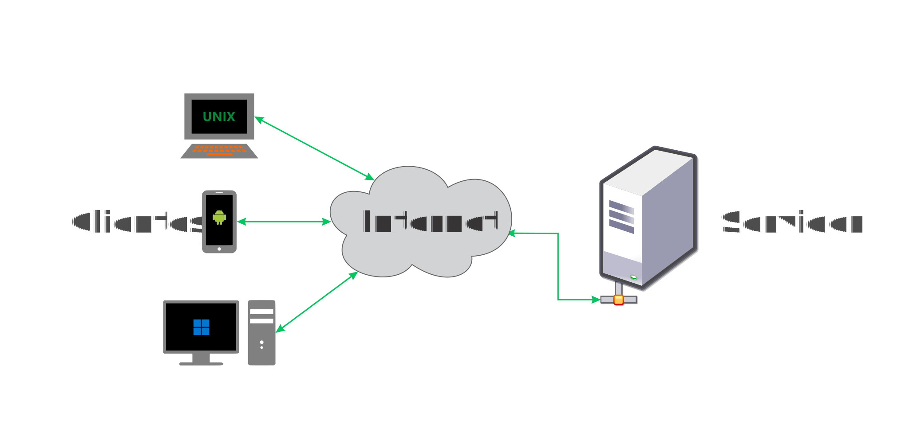

# Sistemas Descentralizados

<code>Fundamentos de sistemas Distribuidos</code>

Creado por <code>GncDev</code> para explicar los fundamentos de los <code>Sistemas distribuidos</code>.

## Arquitecturas de software
La arquitectura de software de un sistema es el conjunto de estructuras necesarias para dar sentido a un sistema, lo cual abarca los elementos del software, las relaciones entre ellos y las propiedades de ambos

## Agenda
1. [Monolíticas](#1-monolíticas).
1. [Distribuidas en capas](#2-distribuidas-en-capas).
1. [Distribuidas en dominios](#3-distribuidas-en-dominios).
1. [Descentralizadas](#4-descentralizadas).

 

---
# 1. [Monolíticas](#agenda)
Una arquitectura [monolítica][1] se refiere a una aplicación de software en la que la capa de interfaz de usuario, lógica de negocios y la capa de acceso a datos están combinadas en un mismo programa, en el mismo lugar y sobre una misma plataforma.

* ><i>"La ciencia es una ecuación diferencial; 
la religión es una condición de frontera."</i> 
<cite style="display:block; text-align: right">[Alan Turing](https://es.wikipedia.org/wiki/Alan_Turing)</cite>

[1]:https://es.wikipedia.org/wiki/Aplicaci%C3%B3n_monol%C3%ADtica

## 1.1. Servicios en internet ✔

## 1.2. Patrón Cliente-Servidor ✔
Una arquitectura [Client–server][1] se refiere a un sistema donde los clientes inteligentes se ponen en contacto con el servidor para hacer peticiones de datos, formatearlos y mostrarlos en una vista a los usuarios. Si los datos fueron modificados por el cliente se envían para persistir los datos en el servidor.

[1]:https://es.wikipedia.org/wiki/Cliente-servidor

### 1.2.1. Características.
* Los clientes hacen solicitudes de servicio.
* Los servidores dan respuesta a solicitudes de servicio.
* Los clientes inician la comunicación con el servidor.
* Los Los servidores proveen el servicio.

### 1.2.2. Multiples clientes.

 

# 2. [Distribuidas en capas](#agenda)
Una arquitectura [n-Tier][2] o Multi-capas se refiere a sistemas donde un servidor reenvía peticiones del cliente a otros servicios conectados en cascada, estas horizontales son conocidas como capas.

* ><i>"Es indigno que hombres notables pierdan su tiempo como esclavos del cálculo cuando podrían dejar ese trabajo en manos de cualquiera si se usaran las máquinas."</i> <cite style="display:block; text-align: right">[Gottfried Leibniz](https://es.wikipedia.org/wiki/Gottfried_Leibniz)</cite>

[2]:https://es.wikipedia.org/wiki/Programaci%C3%B3n_por_capas

## 2.1. Características ✔
* Los terminales locales realizan procesos propios.
* Los procesos locales y remotos no comparten memoria.
* Los terminales locales y remotos comparten recursos en una red.
* Los procesos remotos pueden ejecutarse sincronizados o pueden ser asíncronos.
* Capacidad de escalar verticalmente y horizontalmente.
* Clientes débilmente acoplados al servidor, si alguna capa falla puede fallar la aplicación.

## 2.2. Ejemplos ✔
* [Frontend][22_1] - [Backend][22_2] : [2][22_3] capas.
* [Presentación][22_4] - [Lógica][22_5] - [Datos][22_7] : [3][22_8] capas.
* [Presentación][22_4] - [Aplicación][22_5] - [Dominio][22_6] - [Persistencia][22_7] : [4][22_9] capas.

[22_1]:https://es.wikipedia.org/wiki/Desarrollo_web_Front-end
[22_2]:https://es.wikipedia.org/wiki/Front_end_y_back_end
[22_3]:https://es.wikipedia.org/wiki/Front_end_y_back_end
[22_4]:https://es.wikipedia.org/wiki/Interfaz_de_usuario
[22_5]:https://en.wikipedia.org/wiki/Business_logic
[22_6]:https://en.wikipedia.org/wiki/Domain_(software_engineering)#
[22_7]:https://en.wikipedia.org/wiki/Data_access
[22_8]:https://en.wikipedia.org/wiki/Multitier_architecture#Three-tier_architecture
[22_9]:https://es.wikipedia.org/wiki/Arquitectura_multicapa

## 2.3. Multiples servidores en cascada ✔

 

# 3. [Distribuidas en dominios](#agenda)
Una arquitectura [distribuida verticalmente][3] se refiere  a sistemas donde un servidor reenvía peticiones del cliente a multiples servicios conectados en paralelo; estas verticales se conocen como dominios.

* ><i>"La gente con conocimientos técnicos está dispuesta a perdonar a un ordenador que se cuelga un par de veces al año, pero los usuarios normales no."</i> <cite style="display:block; text-align: right"> [Andrew S. Tanenbaum](https://es.wikipedia.org/wiki/Andrew_S._Tanenbaum)</cite>

[3]:https://es.wikipedia.org/wiki/Modelo_de_dominio

## 3.1. Patron proxy inverso ✔
Un [proxy inverso][31] es un tipo de servidor proxy que recupera recursos en nombre de un cliente externo, desde uno o más servidores internos.

[31]:https://es.wikipedia.org/wiki/Proxy_inverso

 

# 4. [Distribuidas](#agenda)
Una arquitectura [P2P][4] se refiere a sistemas donde no hay máquinas especiales que presten un servicio o gestionen los recursos de la red. En su lugar, todas las responsabilidades se reparten uniformemente entre todas las máquinas, conocidas como peers.

* ><i>"Si nadie se ríe de alguna de tus ideas, entonces significa que no estás siendo demasiado creativo."</i> <cite style="display:block; text-align: right"> [Bill Gates](https://es.wikipedia.org/wiki/Bill_Gates)</cite>

[4]:https://es.wikipedia.org/wiki/Peer-to-peer

## 4.1. Patron P2P
Una arquitectura [P2P][41] se refiere a sistemas donde no hay máquinas especiales que presten un servicio o gestionen los recursos de la red. En su lugar, todas las responsabilidades se reparten uniformemente entre todas las máquinas, conocidas como peers.

[41]:https://es.wikipedia.org/wiki/Peer-to-peer

### 4.1.1. Características.
* Procesamiento Cooperativo.
* Los procesos locales y remotos no comparten memoria.
* Los procesos remotos son asíncronos.
* Operaciones similares o idénticas para acceder a objetos locales o remotos.
* Capacidad de escalar verticalmente y horizontalmente.
* Clientes desacoplados a un servidor, la falla de un terminal no afecta al sistema.

### 4.1.2. Multiples servidores.

 

## 4.2. Patron cadena de bloques ✔
Un sistema [descentralizado][42] es un grupo de entidades que permiten el procesamiento de información intercambiando información entre pares, sin que exista un nodo único que toma las decisiones. 

[42]:https://en.wikipedia.org/wiki/Distributed_operating_system

### 4.2.1. Características.
* Un solo nodo no conoce el estado de todo el sistema.
* Cada nodo toma la decision mas conveniente.
* La respuesta colectiva se logra en función del consenso entre pares.
* Multiples controladores.
* Distribución de los costes (recursos) entre los usuarios.
* Capacidad de escalar horizontalmente con rapidez.
* Clientes desacoplados.

### 4.2.2. Multiples servidores.

 

---
## Mas Recursos
- [Cadena de bloques](https://es.wikipedia.org/wiki/Cadena_de_bloques) (Wikipedia)
- [Red entre iguales](https://es.wikipedia.org/wiki/Peer-to-peer) (Wikipedia)