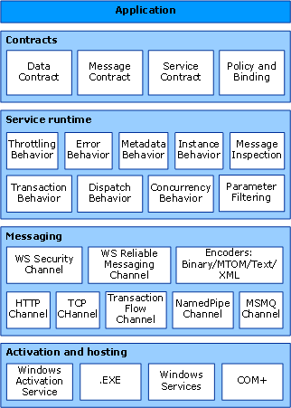

# Sistemas Descentralizados

<code>Fundamentos de sistemas Distribuidos</code>

Creado por <code>GncDev</code> para explicar los fundamentos de los <code>Sistemas distribuidos</code>

## Objetos Distribuidos
En los sistemas Cliente/Servidor, un objeto distribuido es aquel que está gestionado por un servidor y sus clientes invocan sus métodos utilizando un «método de invocación remota». El cliente invoca el método mediante un mensaje al servidor que gestiona el objeto, se ejecuta el método del objeto en el servidor y el resultado se devuelve al cliente en otro mensaje.

## Agenda
1. [Distributed Component Object Model](#1-distributed-component-object-model).
1. [Remote Invocation Method](#2-remote-invocation-method).
1. [Common Object Request Broker Architecture](#2-common-object-request-broker-architecture).

 

---
# 1. [Distributed Component Object Model](#agenda)
El Modelo de Objeto Componente Distribuido, [DCOM][1]; esta incluido en los sistemas operativos de Microsoft. Es un juego de conceptos e interfaces de programa, en el cual los objetos de programa del cliente, pueden solicitar servicios de objetos de programa servidores en otras computadoras dentro de una red. Esta tecnología está asociada a la plataforma de productos Microsoft.

[1]:https://es.wikipedia.org/wiki/Modelo_de_Objetos_de_Componentes_Distribuidos

1.1. Historia ✔
* 1990: [OLE][11_1] permite compartir objetos entre procesos.
* 1993: [COM][11_2] es incluido en Win 95 y windows NT 4.0
* 1996: [DCOM][11_3] extiende COM resolviendo problemas de serialization.
* 1996: [ActiveX][11_4] extiende DCOM en IE.
* 2002: [.NET Remoting][11_5] es incluido en Win XP.
* 2006: [WCF][11_6] es incluido en Windows vista.

[11_1]:https://es.wikipedia.org/wiki/Object_Linking_and_Embedding
[11_2]:https://es.wikipedia.org/wiki/Component_Object_Model
[11_3]:https://es.wikipedia.org/wiki/Modelo_de_Objetos_de_Componentes_Distribuidos
[11_4]:https://es.wikipedia.org/wiki/ActiveX
[11_5]:https://en.m.wikipedia.org/wiki/.NET_Remoting
[11_6]:https://es.wikipedia.org/wiki/Windows_Communication_Foundation

1.2. Capas ✔
* __Contratos:__ describe cada parámetro que compone cada mensaje.
* __Tiempo de ejecución:__ describe comportamientos que ocurren durante la operación del servicio.
* __Mensajes:__ describe los canales de comunicación.
* __Alojamiento:__ describe el tipo de servicio.

1.3 Arquitectura WCF ✔

1.4 Recursos ✔
* [WCF](https://en.wikipedia.org/wiki/Windows_Communication_Foundation) (Wikipedia)
* [Tutorial Oficial](https://learn.microsoft.com/en-us/dotnet/framework/wcf/getting-started-tutorial) (Microsoft)
* [Documentación Oficial](https://learn.microsoft.com/en-us/dotnet/framework/wcf/) (Microsoft)

 

# 2. [Remote Invocation Method](#agenda)
El sistema de Invocación Remota de Métodos, [RMI][2]; de Java permite, a un objeto que se está ejecutando en una Máquina Virtual Java (VM), llamar a métodos de otro objeto que está en otra VM diferente. Esta tecnología está asociada al lenguaje de programación Java, es decir, que permite la comunicación entre objetos creados en este lenguaje.

[2]:https://es.wikipedia.org/wiki/Java_Remote_Method_Invocation

2.1. Historia ✔
* 1996: [JDK 1.0][21_1] lanzamiento de Java.
* 1997: [RMI][21_2] primera version en JDK 1.1.
* 1998: [Java IDL][21_3] lanzamiento en J2SE 1.2 con compatibilidad CORBA.
* 2000: [RMI+][21_4] nueva versión en J2SE 1.3 basada en CORBA.
* 2002: [FOSS][21_5] serialization, criptografía en J2SE 1.4.
* 2004: [STUB][21_6] automático para RMI en J2SE 1.5.

[21_1]:https://en.wikipedia.org/wiki/Java_version_history
[21_2]:https://es.wikipedia.org/wiki/Java_Remote_Method_Invocation
[21_3]:https://es.wikipedia.org/wiki/Java_IDL
[21_4]:https://es.wikipedia.org/wiki/Java_SE
[21_5]:https://es.wikipedia.org/wiki/Software_libre_y_de_c%C3%B3digo_abierto
[21_6]:https://es.wikipedia.org/wiki/Stub

2.2. Capas ✔
* __Aplicación:__ RMI / cliente - servidor
* __Proxy:__ stub - skeleton
* __Referencia remota:__ conexión stream
* __Transporte:__ JRMP / Java Remote Method Protocol

2.3 Arquitectura JRMP ✔

2.4 Recursos ✔
* [JRMI](https://en.wikipedia.org/wiki/Java_remote_method_invocation) (Wikipedia)
* [Tutorial Oficial](https://docs.oracle.com/javase/tutorial/rmi/index.html) (Oracle)
* [Documentación Oficial](https://docs.oracle.com/javase/7/docs/technotes/guides/rmi/index.html) (Oracle)

 

# 3. [Common Object Request Broker Architecture](#agenda)
La Arquitectura de agente de solicitud de objetos comunes, [CORBA][3]; Es una especificación definida por la OMG (Object Management Group) diseñada para facilitar la comunicación entre plataformas distintas en sistemas distribuidos.

[3]:https://es.wikipedia.org/wiki/CORBA

3.1. Historia ✔
* 1991: [C Mapping][31_1] CORBA version 1.0.
* 1998: [Java Mapping][31_2] CORBA version 2.2.
* 2000: [Bonobo][31_3] modelo CORBA incluido en Gnome 1.2.
* 2002: [CORBA Component Model][31_4] CORBA version 3.0.
* 2003: [Gnome 2][31_5] usa de forma extensiva Bonobo.
* 2008: [D-Bus][31_6] reemplaza a Bonobo en Gnome 2.22.

[31_1]:https://es.wikipedia.org/wiki/C_(lenguaje_de_programaci%C3%B3n)/
[31_2]:https://es.wikipedia.org/wiki/Java_(lenguaje_de_programaci%C3%B3n)/
[31_3]:https://en.wikipedia.org/wiki/Bonobo_(GNOME)/
[31_4]:https://en.wikipedia.org/wiki/Common_Object_Request_Broker_Architecture#CORBA_Component_Model_(CCM)/
[31_5]:https://en.wikipedia.org/wiki/GNOME_2
[31_6]:https://es.wikipedia.org/wiki/D-Bus

3.2. Capas ✔
* __Object reference:__ Ubicación del objeto CORBA.
* __Stub:__ interfaz declarada en [IDL][32_2] en el cliente.
* __Skeleton:__ interfaz declarada en [IDL][32_2] en el servidor.
* __Agente de solicitud de objetos:__ middleware [GIOP][32_4]

[32_2]:https://es.wikipedia.org/wiki/Lenguaje_de_descripci%C3%B3n_de_interfaz
[32_4]:https://es.wikipedia.org/wiki/GIOP

3.3 Arquitectura CORBA ✔

3.4 Recursos ✔
* [CORBA](https://en.m.wikipedia.org/wiki/Common_Object_Request_Broker_Architecture) (Wikipedia)
* [Pagina Oficial](https://www.corba.org/index.htm) (CORBA)
* [Especificación Oficial](https://www.omg.org/spec/CCM/) (OMG)

 

---
## Mas Recursos
- [Java: programación)](https://es.wikipedia.org/wiki/Java_(lenguaje_de_programaci%C3%B3n)) (Wikipedia)
- [Distributed object](https://en.m.wikipedia.org/wiki/Distributed_object) (Wikipedia)
- [Llamada a procedimiento remoto](https://es.wikipedia.org/wiki/Llamada_a_procedimiento_remotos) (Wikipedia)
- [Simple Object Access Protocol](https://es.wikipedia.org/wiki/Simple_Object_Access_Protocol) (Wikipedia)